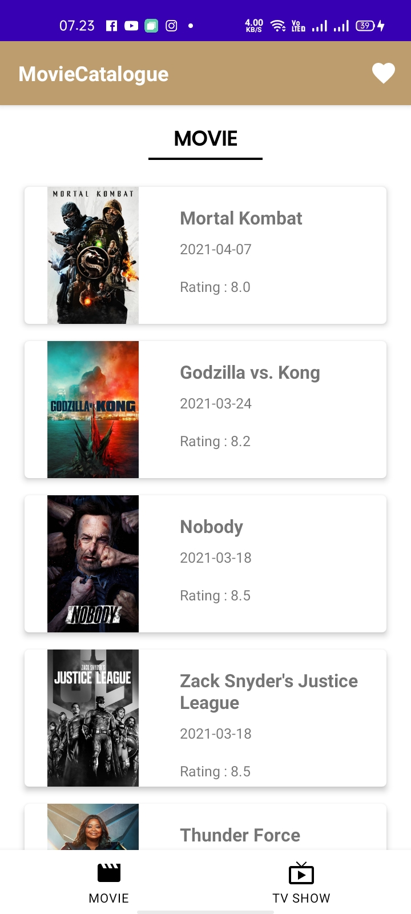

# MovieCatalogue Final Submissio
### Belajar Android Jetpack Pro dari Dicoding

Aplikasi Movie Catalogue merupakan submission dari kelas Belajar Android Jetpack Pro dari dicoding, dan ini untuk memenuhi submission 3 atau Final Submissio

### Project ini menerapkan Architecture Component, Repository & LiveData
- Room
- ViewModel
- RecyclerView
- Detail
- Repository Pattern
- Live Data
- Idling
- Pagination
- Unit Test
- Instrumental Test

## Logo

## Preview App

